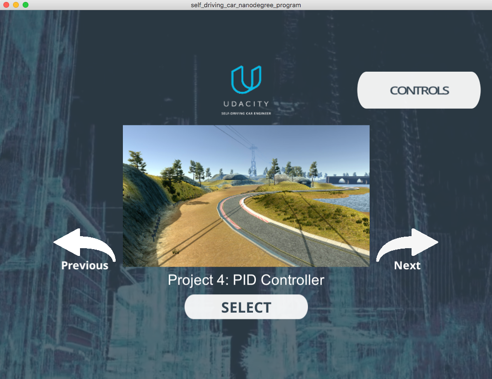

# CarND-PID-Control-P4
Udacity Self-Driving Car Nanodegree - PID Control project

# Overview

This project implements a [PID controller](https://en.wikipedia.org/wiki/PID_controller) to control a car in Udacity's simulator([it could be downloaded here](https://github.com/udacity/self-driving-car-sim/releases)). The simulator sends cross-track error, speed and angle to the PID controller(PID) using [WebSocket](https://en.wikipedia.org/wiki/WebSocket) and it receives the steering angle ([-1, 1] normalized) and the throttle to drive the car. The PID uses the [uWebSockets](https://github.com/uNetworking/uWebSockets) WebSocket implementation. Udacity provides a seed project to start from on this project ([here](https://github.com/udacity/CarND-PID-Control-Project)).

# Prerequisites

The project has the following dependencies (from Udacity's seed project):

- cmake >= 3.5
- make >= 4.1
- gcc/g++ >= 5.4
- Udacity's simulator.

For instructions on how to install these components on different operating systems, please, visit [Udacity's seed project](https://github.com/udacity/CarND-PID-Control-Project). As this particular implementation was done on Mac OS, the rest of this documentation will be focused on Mac OS. I am sorry to be that restrictive.

In order to install the necessary libraries, use the [install-mac.sh](./install-mac.sh).

# Compiling and executing the project

In order to build the project there is a `./build.sh` script on the repo root. It will create the `./build` directory and compile de code. This is an example of the ouput of this script:

```
> ./build.sh
-- The C compiler identification is AppleClang 8.0.0.8000042
-- The CXX compiler identification is AppleClang 8.0.0.8000042
-- Check for working C compiler: /Library/Developer/CommandLineTools/usr/bin/cc
-- Check for working C compiler: /Library/Developer/CommandLineTools/usr/bin/cc -- works
-- Detecting C compiler ABI info
-- Detecting C compiler ABI info - done
-- Detecting C compile features
-- Detecting C compile features - done
-- Check for working CXX compiler: /Library/Developer/CommandLineTools/usr/bin/c++
-- Check for working CXX compiler: /Library/Developer/CommandLineTools/usr/bin/c++ -- works
-- Detecting CXX compiler ABI info
-- Detecting CXX compiler ABI info - done
-- Detecting CXX compile features
-- Detecting CXX compile features - done
-- Configuring done
-- Generating done
-- Build files have been written to: REPO_ROOT/CarND-PID-Control-P4/build
Scanning dependencies of target pid
[ 33%] Building CXX object CMakeFiles/pid.dir/src/PID.cpp.o
[ 66%] Building CXX object CMakeFiles/pid.dir/src/main.cpp.o
[100%] Linking CXX executable pid
[100%] Built target pid
```

The project could be executed directly using `./build/pid` or if there are some modification and a build is needed you can use the script `./makeAndrun.sh`:

```
> ./makeAndrun.sh
[100%] Built target pid
Listening to port 4567
```

Now the PID controller is running and listening on port 4567 for messages from the simulator. Next step is to open Udacity's simulator:


Using the right arrow, you need to go to the Project 4: PID Controller project:



Click the "Select" button, and the car starts driving. You will see the debugging information on the PID controller terminal. A short video with the final parameters is [./videos/final-parameters.mov](./videos/final-parameters.mov).

# [Rubric](https://review.udacity.com/#!/rubrics/824/view) points

## Compilation

### Your code should compile.

The code compiles without errors or warnings. No modifications were done on the provided setup.

## Implementation

### The PID procedure follows what was taught in the lessons.

The PID implementation is done on the [./src/PID.cpp](./src/PID.cpp). The [PID::UpdateError](./src/PID.cpp#L33) method calculates proportional, integral and derivative errors and the [PID::TotalError](./src/PID.cpp#L55) calculates the total error using the appropriate coefficients.

## Reflection

### Describe the effect each of the P, I, D components had in your implementation.

- The proportional portion of the controller tries to steer the car toward the center line (against the cross-track error). If used along, the car overshoots the central line very easily and go out of the road very quickly. An example video where this component is used along is [./videos/only-proportional.mov](./videos/only-proportional.mov).

- The integral portion tries to eliminate a possible bias on the controlled system that could prevent the error to be eliminated. If used along, it makes the car to go in circles. In the case of the simulator, no bias is present. An example video where this component is used along is [./videos/only-integral.mov](./videos/only-integral.mov).

- The differential portion helps to counteract the proportional trend to overshoot the center line by smoothing the approach to it. An example video where this component is used along is [./videos/only-differential.mov](./videos/only-differential.mov).

### Describe how the final hyperparameters were chosen.

The parameters were chosen manually by try and error. First, make sure the car can drive straight with zero as parameters. Then add the proportional and the car start going on following the road but it starts overshooting go out of it. Then add the differential to try to overcome the overshooting. The integral part only moved the car out of the road; so, it stayed as zero. After the car drove the track without going out of it, the parameters increased to minimize the average cross-track error on a single track lap. The final parameters where [P: 1.5, I: 0.0, D: 2.5].

## Simulation

### The vehicle must successfully drive a lap around the track.

A short video with the final parameters is [./videos/final-parameters.mov](./videos/final-parameters.mov).
